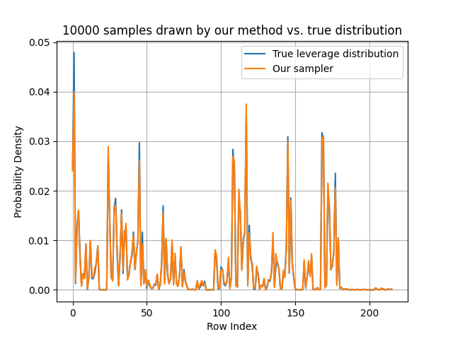

# Fast Exact Leverage Score Sampling from Khatri-Rao Products with Applications to Tensor Decomposition
This repository contains the code for
the paper [Fast Exact Leverage Score Sampling
from Khatri-Rao Products](https://arxiv.org/pdf/2301.12584),
to appear at Neurips 2023 (Main conference, poster).

## What can I do with it?
You can draw samples from the Khatri-Rao product of matrices
with tens of millions of rows each, provided the rank is at most
100-200 (and you have enough memory to store the inputs). These
samples are drawn according to the exact distribution of leverage
scores on the rows of the Khatri-Rao product, which have attractive
properties for randomized linear least-squares.

On LBNL Perlmutter CPU nodes, our code can draw 50,000 samples from
a Khatri-Rao product with $\approx 10^{21}$ total rows and 32 columns
in under 0.33 seconds.  

Here's a smaller test case that can run on a laptop:
```python
import numpy as np
import cppimport.import_hook
from cpp_ext.als_module import Sampler

if __name__=='__main__':
    # Take J=10,000 samples from the KRP of N=4 matrices,
    # each with dimensions I x R, where I = 1000 and R = 8.
    I, N, J, R = 1000, 4, 10000, 8
    matrices = [np.random.normal(size=(I, R)) for i in range(N)]

    sampler = Sampler(matrices, J, R, "efficient")
    samples = np.zeros((N, J), dtype=np.uint64)
    sampler.KRPDrawSamples(N+1, samples)
```

## Details
This repository contains two implementations of the
data structure in the paper. The first,
available in the folder `reference_implementation`,
is written entirely in Python with Numpy. It is
slow, but the structure of the code matches
the pseudocode in our paper almost line-for-line. You
can use it to verify the correctness of our algorithm
or pick apart how the data structure works. You only need
Python, Numpy, and Matplotlib to test the reference
implementation - see the README inside the folder for
more instructions.

The second implementation is a fast version written
in C++, with Pybind11 Python bindings 
and compatibility with Numpy for easy 
testing. All benchmarks were conducted
with the fast version, and all instructions detail
how to build the fast version.

This repository contains a copy of `json.hpp`
from Niels Lohmann's repository 
<https://github.com/nlohmann/json>. It is published
under an MIT license.

## Requirements
You need GCC 11.2+, OpenMP, and an install of the BLAS
and LAPACK. This code has been tested with OpenBLAS, and
we make no guarantees for Intel MKL or other BLAS
implementations. If you decide to use MKL, either a) 
try using the Intel C++ compiler instead of GCC or b) if you use GCC, 
link MKL in sequential mode. We have observed segfaults
when OpenMP threading is enabled in conjunction with
MKL (when compiled with GCC).

We strongly recommended that you install Intel
Thread Building Blocks (TBB), but this is not
required. We rely on Intel TBB for fast parallel 
sorting during sparse tensor decomposition.

Our C++ code could stand alone, but right now, you
need Python as well to run it. 

## Building our code

### Step 0: Clone the Repository
Clone the repoitory and `cd` into it. The exact
name of the repository has been omitted below to
preserve anonymity during the reviewing process.
```
git clone <FULL PATH HERE>/fast_tensor_leverage.git
cd fast_tensor_leverage
```

### Step 1: Install Python packages
Install Python dependencies with the following command:
```
pip install -r requirements.txt
```
We rely on the Pybind11 and cppimport packages. We
use the HDF5 format to store sparse tensors, so
you need the h5py package if you want to perform
sparse tensor decomposition. 

### Step 2: Configure the compile and runtime environments 
Within the repository, run the following command:
```
python configure.py
```
This will create two files in the repository root:
`config.json` and `env.sh`. Edit the configuration
JSON file with include / link flags for your LAPACK
install. If you have TBB installed (strongly
recommended for good performance), fill in the appropriate
entries. If you do not have TBB installed (or if you
are using a compiler that automatically links the BLAS),
set those JSON entries to empty lists. 

The file `env.sh` sets up the runtime environment,
and must be called every time you start a new shell 
to run our code. First, set the variables CC
and CXX to your C and C++ compilers. The C++ extension
module is compiled with
these when it is imported by Python at runtime. 

Next, update your LD_LIBRARY_PATH 
to include the BLAS and TBB library folders using
`env.sh`. You should also set the number of
OpenMP threads based on your system configuration. 

### Step 3: Test the code 
You're ready to test! The C++ extension
compiles automatically the first time you run
the code, and is not compiled subsequently. Run
the following code:
```
python compare_distributions.py
```
If all goes well, you should see a new graph in
the `plotting` folder called
`distribution_comparison_test_generated.png`
(ignore the file `distribution_comparison.png`, which
is the control image for the README).
The graph should look like this:


This image compares the true probability
distribution of leverage scores of the
Khatri-Rao product 
$U_1 \odot U_2 \odot U_3$ (all
chosen as $8 \times 8$ matrices to make
the graph readable) to a
histogram of samples taken by our sampler.
There is excellent agreement between the
distribution that our sampler draws from
and the true leverage score distribution.

